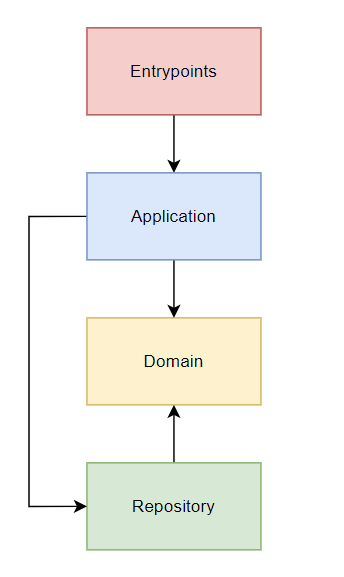

# **Template para desenvolvimento de microsserviços utilizando framework .NET 6.0**

Template criado com a finalidade de auxiliar desenvolvedores a criar microsserviços.

## **Tecnologias utilizadas**

- .NET Framework 6.0
- RabbitMQ
- Entity Framework Core
- SQL Server

## **Estrutura do projeto**

&nbsp;

&nbsp;

## **Desenvolvendo o microsserviço**

Cada camada possui sua funcionalidade. 

O Domain será responsável por conter as regras de negócio. Através da pasta **Models** dentro do projeto **Domain** será contido as classes de domínio da aplicação. Na pasta **Interface** deverão ser contidas as interfaces de repositório, e assim implementar métodos para manipulação do domínio.

O Application será responsável pela manipulação do domínio através do repositório e deverão ser implementados métodos para tal adicionando serviços no projeto **Application**.

O Repository será responsável pela conexão com o banco de dados. Devem ser implementadas os repositórios dentro da pasta **Repositories** utilizando as interfaces do domínio. Também é necessário adição do Dbset na classe **AppDbContext**

O Entrypoint será o responsável pela conexão com aplicações externas, seja por API ou por microsserviço. Neste projeto é necessário configurar a conexão com o banco de dados e com o RabbitMQ dentro do arquivo **appsettings.json** e adicionar **Controllers** e **Consumers** dentro de suas respectivas pastas para que este serviço esteja disponível para o ambiente externo.

